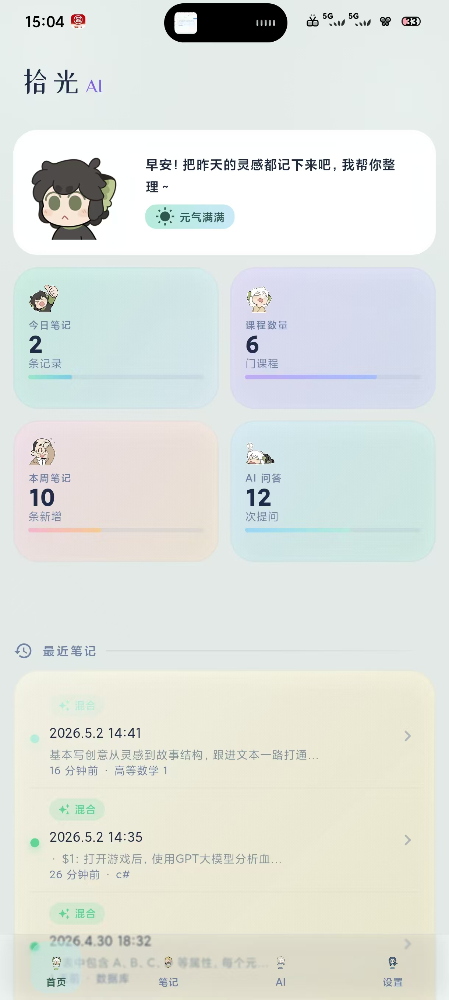
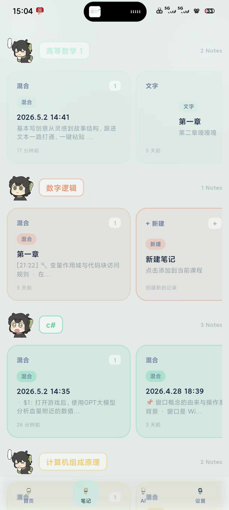
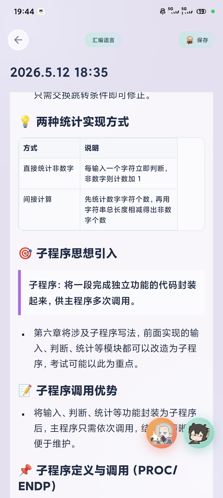

# 拾光 AI

拾光 AI 是一个 Flutter Android 笔记应用，集成离线语音识别、语音笔记、文字笔记、拍照记录、AI 整理和本地笔记问答。

## 主要功能

- 首页统计、最近笔记和课程入口。
- 课程分类与笔记管理。
- 语音录音、离线 ASR 识别、流式显示语音笔记。
- DeepSeek AI 整理笔记、失败/中断重试。
- 文字笔记、拍照记录、AI 整理详情展示。
- 本地笔记知识库问答；没有找到笔记依据时，会提示后使用模型通用能力回答。

## 应用截图

<p align="center">
  
  
  
</p>

从左到右分别是首页统计与最近笔记、课程分组管理、AI 整理后的笔记详情。

## 运行环境

- Flutter SDK：建议使用 `3.35.x` 或兼容 Dart `^3.9.2` 的版本。
- Android SDK：可正常构建 Flutter Android 项目。
- Java / Gradle：使用 Flutter Android 默认工具链即可。

安装依赖：

```bash
flutter pub get
```

运行：

```bash
flutter run
```

构建调试 APK：

```bash
flutter build apk --debug
```

构建 release APK：

```bash
flutter build apk --release
```

release 构建需要本地签名文件。仓库不会提交签名证书和密码配置，请在本机准备：

```text
android/key.properties
android/app/*.jks
```

`android/key.properties` 示例：

```properties
storePassword=your-store-password
keyPassword=your-key-password
keyAlias=your-key-alias
storeFile=your-release-key.jks
```

## 必需模型文件

本项目依赖本地离线语音识别模型。由于 GitHub 单文件大小限制，ONNX 大模型没有提交到仓库，需要手动放到以下路径：

```text
assets/paraformer/encoder.int8.onnx
assets/paraformer/decoder.int8.onnx
assets/paraformer/tokens.txt
assets/sensevoice/model.int8.onnx
assets/sensevoice/tokens.txt
assets/sensevoice/zh.wav
```

当前本地使用的模型体积参考：

```text
assets/sensevoice/model.int8.onnx       约 226 MB（237,115,547 bytes）
assets/paraformer/encoder.int8.onnx     约 158 MB（165,462,184 bytes）
assets/paraformer/decoder.int8.onnx     约 68 MB（71,664,561 bytes）
```

注意：

- `assets/**/*.onnx` 已加入 `.gitignore`，不会上传到 GitHub。
- `tokens.txt` 和 `zh.wav` 可以提交；如你替换模型，请保持 `pubspec.yaml` 中 assets 路径一致。
- 如果模型文件缺失，App 可以构建，但本地语音识别功能无法正常初始化。
- 如果需要在新机器打 release 包，必须同时准备模型文件和本地签名文件。

## AI 配置

发布版本不内置任何 API Key。

首次使用 AI 整理或 AI 问答前，需要在 App 设置页配置：

```text
DeepSeek API Key
API URL: https://api.deepseek.com
Model: deepseek-v4-pro
```

如果没有配置 API Key：

- 离线语音识别仍可在模型文件存在时使用。
- AI 整理、AI 问答会提示需要配置 DeepSeek。

## 不提交到 Git 的内容

以下内容不应提交：

- `build/`
- `.dart_tool/`
- APK / AAB 构建产物
- ONNX / BIN / PARAM 等大模型文件
- Android release keystore 与 `android/key.properties`
- 本地 IDE 配置与缓存
- 任何真实 API Key 或私密配置

## 项目结构

```text
lib/
  data/                 数据仓库
  models/               数据模型
  screens/              页面
  services/ai/          AI 整理、AI 问答、离线识别服务
  widgets/              通用组件
assets/
  paraformer/           Paraformer 离线识别模型
  sensevoice/           SenseVoice 离线识别模型
ui/                     图标、动效和 UI 资源
```

